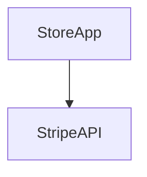
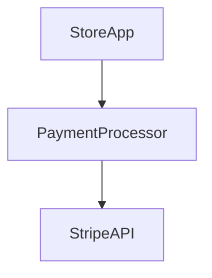
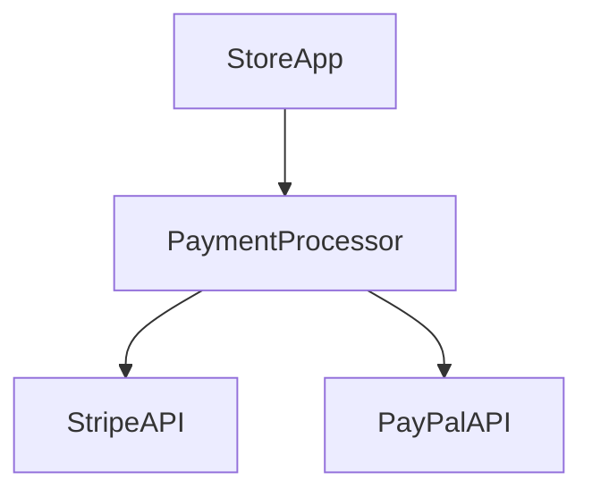

# Dependency inversion principle

The main idea of the dependency inversion principle is that any class that uses a dependency should only ever use the dependency through a predefined interface/wrapper.

This makes it so that your code will never directly depend on a low level API for its operations. The reason this is so important is because if you ever need to change or remove that dependency it becomes really difficult when it is used all over your code.

By wrapping this dependency in an interface you can depend on the interface you created which will make changing out the dependency painless.

Let's imagine that we have a store application that allows the user to buy things from out store 👇

## ❌ Without dependency inversion

In this situation, we are dependent directly to the Stripe API. We are completly coupled.

In other words, our store, depends on the Stripe API.

What happens if we want to change to another payment API or add it to out app? Or if we just want to test our code using another API before changing or adding?

## ✅ With dependency inversion

If we build something in the middle, we can abstract the depedencies.

Now, if we want to integrate another API, we just need to add it and implement our abstraction.

💡 You don't want your high level code to depend on the low level implementation of your dependencies. You don't want to depend on how stripe works or how paypal works. You want to depend on the payment processor that wraps those functionalities.

## Advantages

- Your code will not be coupled to external API or other implementations
- Scalable
- Maintainable
- Clean

## Disadvantages

- You may need to refactor a lot of things
- Cost of refactor